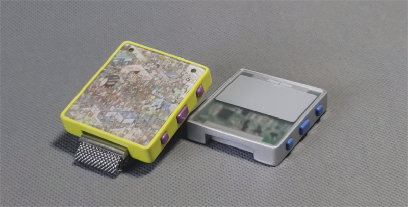
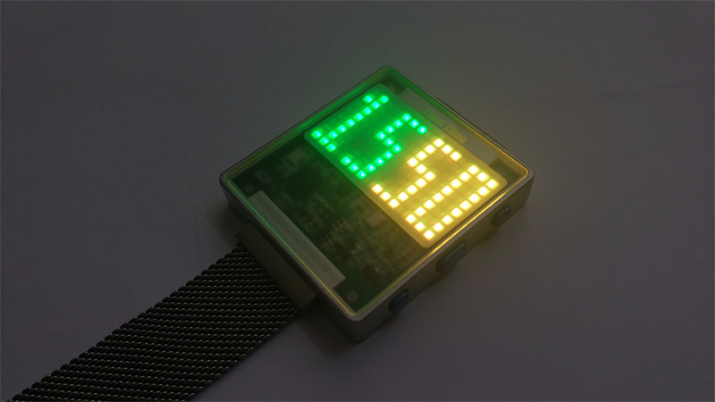
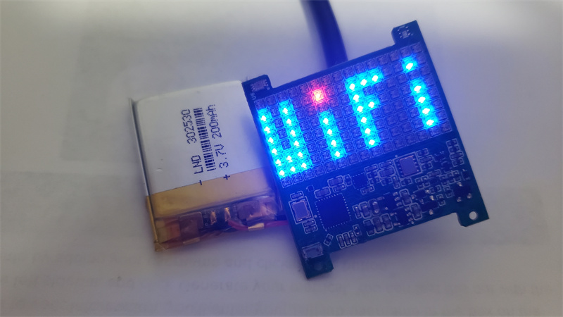
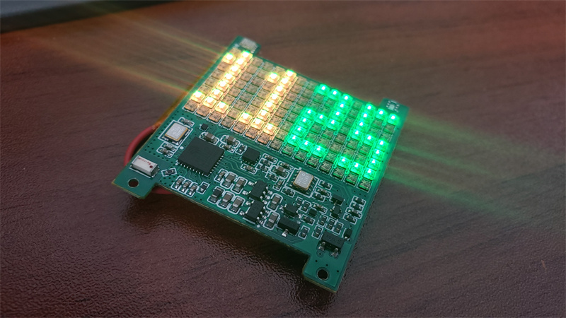
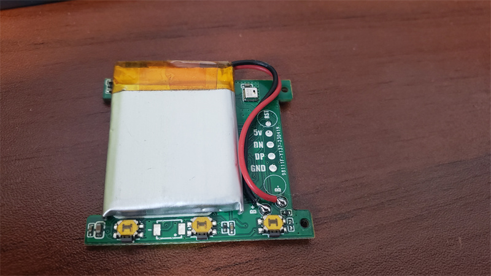
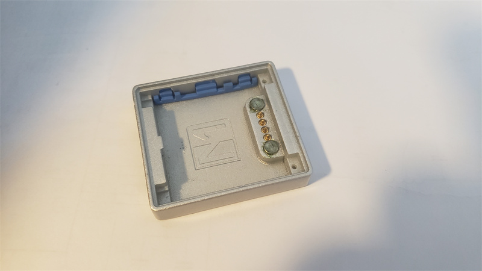
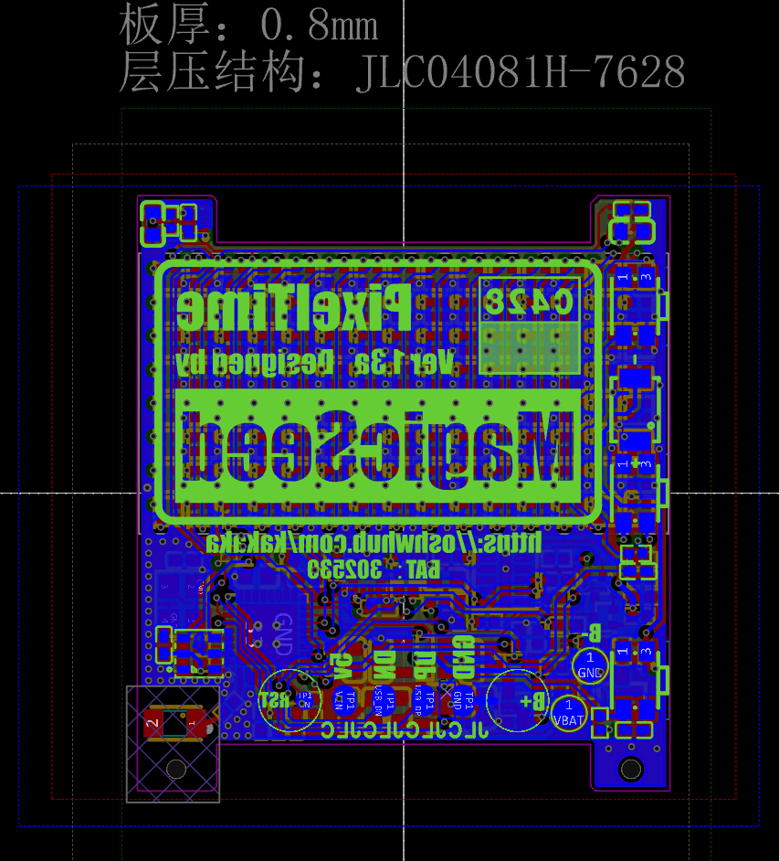

     
    
     

   
    
      

# [PixelTime](https://oshwhub.com/kakaka/PixelTime)
a low power led watch based on ESP32-C3 & MicroPython

[afdian.net](https://afdian.net/a/modular)    [bilibili](https://www.bilibili.com/video/BV1Bj411i7ZR/)   [OSHWHUB](https://oshwhub.com/kakaka/PixelTime)

## Software

based on MicroPython

## Mechanical

 

## License

(hardware/mechanical)[Creative Commons — Attribution-NonCommercial-ShareAlike 4.0 International — CC BY-NC-SA 4.0](https://creativecommons.org/licenses/by-nc-sa/4.0/)

## Extra

 
